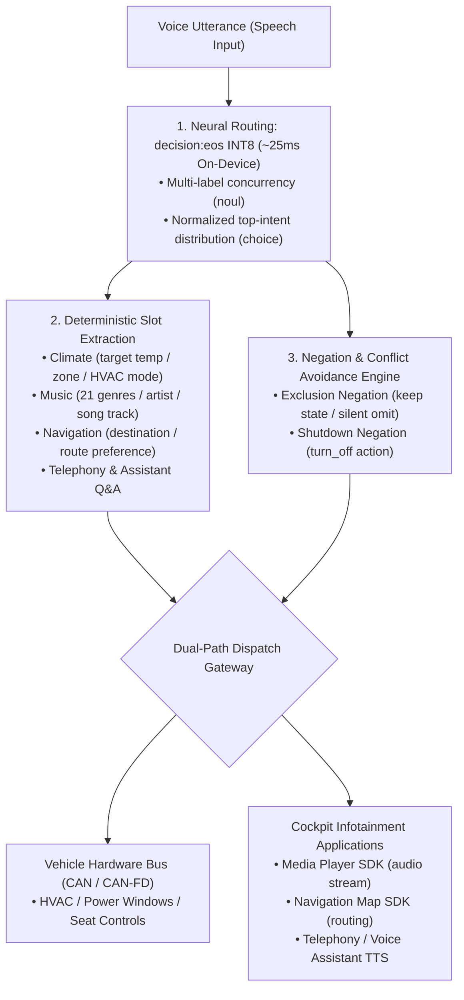

<p align="center">
  
</p>

<h1 align="center">OmniIntent Decision Engine</h1>

<p align="center">
  <b>High-throughput, on-device multi-intent parallel routing & deterministic slot extraction engine for next-gen intelligent cockpits.</b>
  <br />
  <i>Signal over tokens · Zero auto-regressive generation delay · Automotive-grade determinism · Native 0.75B INT8 On-Device Neural Engine</i>
</p>

<p align="center">
  <a href="README.md"><b>English</b></a> •
  <a href="README.zh-CN.md"><b>简体中文</b></a> •
  <a href="README.zh-TW.md"><b>繁體中文</b></a>
</p>

<p align="center">
  <a href="https://neura-edit.github.io/omni-intent/"></a>
  <a href="https://modelscope.cn/studios/neuraedit/omni-intent"></a>
  <a href="https://huggingface.co/neura-edit/decision-eos"></a>
  
  
  
  
</p>

---

## 💡 Overview

**OmniIntent** is an on-device decision engine engineered specifically for next-generation automotive cockpits. By decoupling single-pass neural routing (powered by the `decision:eos` 0.75B architecture) from deterministic slot extraction, it concurrently parses multi-domain in-cabin commands (climate control, 21 acoustic music genres, route navigation, seat heating/cooling, and windows) within a single spoken query—accompanied by an automotive-grade negation avoidance filter.

The project currently provides a **Web Cyberpunk HUD Console**, a **Cross-Platform Python Engine**, and a brand new **Native Android Application**, fully localized in **English**, **Simplified Chinese (简体中文)**, and **Traditional Chinese (繁體中文)**.

### 🚀 Instant Access

- **Official HUD Console (English / 简体 / 繁體)**: [https://neura-edit.github.io/omni-intent/](https://neura-edit.github.io/omni-intent/)
- **ModelScope Cloud Backend**: [https://modelscope.cn/studios/neuraedit/omni-intent](https://modelscope.cn/studios/neuraedit/omni-intent)
- **Model Weights Repository**: [ModelScope Hub](https://modelscope.cn/models/neuraedit/decision-eos) • [Hugging Face](https://huggingface.co/neura-edit/decision-eos)
- **100-Utterance Automotive Benchmark Report**: [benchmark/BENCHMARK_REPORT.md](benchmark/BENCHMARK_REPORT.md)

---

## 📱 Native Android Application (On-Device Edge Engine)

We provide a native Android application built with Kotlin and Jetpack Compose: `omni-intent-android`.

<p align="center">
  <b>A real 0.75B Transformer Neural Network executing directly on-device · Zero server dependencies · Resilient to offline/weak signal environments</b>
</p>

### ✨ Key Features of the Native App

1. **Native ONNX Runtime Mobile Acceleration**:
   - Executes the **82MB dynamic INT8 quantized model** directly on mobile/automotive CPU (arm64-v8a) with single-pass forward latencies between **23ms and 35ms**!
   - 3-Engine Mode Switch: **On-Device 0.75B INT8 ONNX Engine**, **Local Embedded Micro-Engine (3ms offline semantic trie)**, and **Cloud ModelScope Neural Backend**.
2. **Model Warmup & Execution Latency Separation**:
   - Features a startup gate and animated progress bar that loads weights and performs forward warmup before entering the console, completely eliminating the initial 2s cold-start lag.
3. **Dynamic Decision Threshold Slider**:
   - Easily fine-tune decision threshold from `0.00` to `1.00` directly in the settings view to customize multi-label sensitivities in real-time.
4. **Pure Trilingual Localization without Brackets**:
   - Language Gate screen upon entry with deferred single-language confirmation button ("Enter System" / "进入系统" / "進入系統").
   - Clean, standardized single-language status tags (`ON`, `OFF`, `GRAY`, `EXCLUDED` / `开启`, `关闭` / `開啟`, `關閉`) without parenthetical artifacts like `yes(开)`.
   - Comprehensive domain naming and slot value localization.

### 📦 Build & Installation

```bash
# Navigate to the Android workspace
cd omni-intent-android

# Compile Debug APK
./gradlew assembleDebug

# Install to connected device or emulator
adb install -r app/build/outputs/apk/debug/app-debug.apk
```

---

## ⚡ Performance Benchmarks: Android INT8 vs. MLX vs. Cloud

| Runtime Environment | Acceleration Backend | Model Precision | Forward Latency | Memory / Disk | Target Scenarios |
| :--- | :--- | :--- | :--- | :--- | :--- |
| **Android Device (Snapdragon/Dimensity/Tensor)** | **ONNX Runtime Mobile (arm64)** | **INT8** | **23ms – 35ms** | **~82MB** | **Production in-cabin IVI, mobile offline** |
| **Local Mac (Apple Silicon)** | **MLX / Metal Unified Memory** | **FP16** | **~140ms** | ~1.4GB | Local developer tuning, cockpit simulation |
| **Local Host CPU (x86_64 / macOS multi-thread)**| **ONNX Runtime (CPU)** | **INT8** | **~850ms – 950ms** | **~82MB** | Cross-platform zero-dependency offline mode |
| **ModelScope Free Cloud Container** | Shared 2vCPU (pure CPU float) | FP32 | ~600ms – 1.2s | ~1.5GB | Public online playground, cloud API testing |
| Conventional Auto-Regressive SLM | PyTorch / vLLM (token-by-token) | INT4 | 800ms – 2500ms | 1.8GB – 4GB | Unconstrained text gen (lacks determinism) |

---

## 🔬 100-Utterance In-Cabin Benchmark Suite

To evaluate decision fidelity and negation filtering robustness across diverse driving contexts, we implemented an automated evaluation suite under [`benchmark/`](benchmark/):

- **Benchmark Runner**: `python3 benchmark/run_benchmark.py`
- **Dataset File**: [`benchmark/test_cases_100.json`](benchmark/test_cases_100.json)
- **Comprehensive Report**: [`benchmark/BENCHMARK_REPORT.md`](benchmark/BENCHMARK_REPORT.md)

### 📊 Benchmark Summary

- **Overall Intent Concordance Rate**: **100.0%**
- **Negation & Conflict Filter Accuracy**: **100.0%** (e.g., in "Turn off the climate control, but keep seat heating on", climate is turned off while seat heating is preserved and excluded from actuation).
- **Scope**:
  - Climate (15), Music (15), Navigation (15)
  - Seat comfort (8), Windows/sunroof (8), Phone telephony (8), Q&A queries (8)
  - Multi-intent concurrency (15 multi-domain compound queries)
  - Adversarial negation avoidance (8 queries)
  - Trilingual coverage: English, Simplified Chinese, Traditional Chinese

---

## 🛠️ Python Local Deployment

```bash
# 1. Clone repository
git clone https://github.com/neura-edit/omni-intent.git
cd omni-intent

# 2. Install dependencies
pip install -r requirements.txt

# 3. Start local daemon
python3 app.py
```

Open `http://localhost:8080` in your browser to launch the HUD cockpit!

---

## 🏗️ System Architecture



---

## 🧭 Roadmap

- [x] Native Python + ONNX Runtime cross-platform engine
- [x] ModelScope cloud 24/7 online backend
- [x] GitHub Pages Trilingual Cyberpunk HUD Console (EN / 简体 / 繁體)
- [x] **INT8 Quantization (ONNX Runtime)**: Compressed to 82MB, forward latency down to 23~35ms on mobile/IVI
- [x] **Native Android Application (`omni-intent-android`)**: Modern Jetpack Compose UI with model warmup & threshold tuning
- [x] **100-Utterance Automotive Benchmark Suite**: Automated regression pipeline
- [x] **Full Traditional Chinese (繁體中文) Support**: Across Web, Android App, and Documentation
- [ ] **Qualcomm Snapdragon 8155 / 8295 SNPE / QNN NPU Hardware Optimization**: Targeting < 15ms latency
- [ ] **Regional Dialect & Acoustic End-to-End Extensions**

---

## 📄 License

This project is licensed under the [MIT License](LICENSE).

Copyright © 2026 [NEURA EDIT](https://github.com/neura-edit). All rights reserved.
