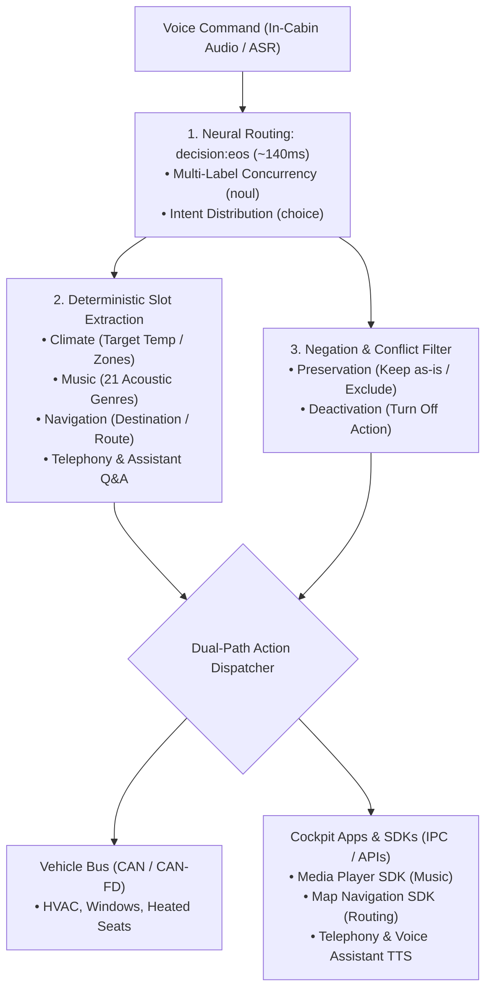

<p align="center">
  
</p>

<h1 align="center">OmniIntent Decision Engine</h1>

<p align="center">
  <b>High-throughput on-device multi-intent routing & deterministic slot extraction for next-generation automotive cockpits.</b>
  <br />
  <i>Signal over tokens · Zero autoregressive delay · Automotive-grade determinism</i>
</p>

<p align="center">
  <a href="README.md"><b>English</b></a> •
  <a href="README.zh-CN.md"><b>简体中文</b></a>
</p>

<p align="center">
  <a href="https://neura-edit.github.io/omni-intent/"></a>
  <a href="https://modelscope.cn/studios/neuraedit/omni-intent"></a>
  <a href="https://huggingface.co/neura-edit/decision-eos"></a>
  
  
  
</p>

---

## 💡 Overview

**OmniIntent** is an on-device decision engine engineered specifically for automotive smart cockpits. By decoupling **single-pass forward neural routing** (`decision:eos` 0.75B transformer architecture) from **deterministic slot extraction**, it concurrently parses compound, multi-domain voice instructions (HVAC, media, navigation, seat comfort, windows) in a single breath—with automotive-grade negation resolution and zero autoregressive token-generation latency.

### 🚀 Live Cloud Demo (Out-of-the-Box)

Experience the live neural network interactive cockpit HUD without installing anything locally:

- **Official Cyberpunk HUD Dashboard (Direct Cloud Neural Link)**: [https://neura-edit.github.io/omni-intent/](https://neura-edit.github.io/omni-intent/)
- **ModelScope Cloud Backend**: [https://modelscope.cn/studios/neuraedit/omni-intent](https://modelscope.cn/studios/neuraedit/omni-intent)
- **Model Weight Repositories**: [ModelScope Hub](https://modelscope.cn/models/neuraedit/decision-eos) • [Hugging Face](https://huggingface.co/neura-edit/decision-eos)

---

## ⚡ Performance: Cloud Shared Instance vs. Local MLX Acceleration

Visitors often notice: **The cloud demo has an end-to-end latency of ~600ms – 1.2s. Why does the documentation highlight ~140ms?**

> [!NOTE]
> **Engineering Latency Breakdown:**
> 1. **Cloud Free-Tier Environment**: The public cloud demo runs on a shared ModelScope virtual machine equipped with `2vCPU` (pure CPU virtualization with no GPU/NPU acceleration). Executing a full FP32/FP16 forward pass of a 0.75B Transformer on 2 virtual CPU cores yields a compute time of **~600ms – 1.2s**.
> 2. **Local Apple Silicon (MLX / Metal Acceleration)**: When deployed locally on Apple Silicon (M-series chips), the model executes natively on **Apple MLX** utilizing the unified memory architecture. This achieves the full advertised **~140ms** forward pass!
> 3. **Quantization in Progress (Roadmap)**: We are currently working on **4-bit / 8-bit weight quantization (INT4 / INT8 / FP16 via MLX & GGUF/ONNX)**. Quantization will compress model memory from 1.4GB down to **~400MB** and drop latency below **50ms**, enabling native deployment on low-power cockpit SoCs such as Qualcomm Snapdragon 8155/8295, Horizon Journey, and NVIDIA Orin.

### 📊 Latency Benchmarks

| Environment | Runtime / Architecture | Precision | Forward Pass Latency | Target Scenario |
| :--- | :--- | :--- | :--- | :--- |
| **Cloud Public Demo (ModelScope)** | Shared 2vCPU (pure virtual CPU) | FP32 / FP16 | ~600ms – 1.2s | Zero-setup public trial, remote API |
| **Local Mac (Apple Silicon)** | **MLX / Metal Unified Memory** | **FP16** | **~140ms** | **Local developer testing, cockpit bench test** |
| **Quantized Model (In Progress 🚧)** | **INT4 / INT8 (MLX / NPU)** | **INT4 / INT8** | **< 50ms** | **Automotive mass production SoCs (8155/8295)** |
| Autoregressive SLM (0.5B – 1.5B) | PyTorch / vLLM (token-by-token) | INT4 | 800ms – 2500ms | Freeform text generation (non-deterministic) |

---

## 🛠️ Local Deployment Guide

If you wish to run OmniIntent on your local workstation for zero-latency neural routing, two deployment options are available:

### Option 1: Cross-Platform Python Deployment (Recommended for Mac / Linux / Windows)

Runs natively via Python 3 and ONNX Runtime without building custom binaries:

```bash
# 1. Clone repository
git clone https://github.com/neura-edit/omni-intent.git
cd omni-intent

# 2. Install lightweight dependencies
pip install -r requirements.txt

# 3. Launch engine (model weights auto-download to local cache on first run)
python3 app.py
```

Open your browser at:
👉 `http://localhost:8080` to access the full local Cyberpunk HUD cockpit console!

---

### Option 2: Apple Silicon Mac with MLX / Ollaya (~140ms Maximum Throughput)

On macOS with Apple Silicon (M1/M2/M3/M4), you can leverage the native Metal/MLX backend:

```bash
# 1. Install & launch Ollaya (native Apple Silicon MLX/Metal backend)
curl -fsSL https://ollaya.dev/install.sh | sh

# 2. Pull the decision:eos model weights (~1.5GB)
ollaya pull decision:eos

# 3. Run dashboard
python3 app.py
```

`app.py` features an automated priority pipeline:
1. Connects to the local Ollaya daemon (`127.0.0.1:11435`) for high-throughput MLX hardware acceleration (~140ms).
2. If Ollaya is not detected, it automatically falls back to the embedded ONNX Runtime session.

---

## 🏗️ System Architecture



---

## 🌟 Key Capabilities

- **True Multi-Intent Concurrency**: Parses compound instructions (e.g. *“It feels stuffy in here, set AC to 22 degrees and play Jay Chou's Sunny Day”* $\to$ Climate 97.4% + Music 97.2% dispatched concurrently).
- **Deterministic Slot Extraction**: Pure regex and trie extractors for target temperatures, cabin zones, 21 acoustic genres, route preferences, and contacts with zero JSON truncation risks.
- **Bipartite Negation Resolution**: Distinguishes preservation intents (*“do not turn off heated seats”* $\to$ excluded from deactivation) from turn-off intents (*“turn off the AC”* $\to$ turn_off action).
- **Automotive-Grade Reliability**: 100% structured schema compliance with zero token hallucination.

---

## 📡 API Specification

### `POST /api/decide`
Performs forward neural routing and returns slot parameters and CAN-bus execution payloads.

#### Request Example
```bash
curl -X POST http://localhost:8080/api/decide \
  -H "Content-Type: application/json" \
  -d '{
    "text": "Turn off the AC, play some jazz, but do not touch heated seats",
    "lang": "en"
  }'
```

#### Response Example
```json
{
  "ok": true,
  "intent": {
    "choice": "music",
    "probabilities": { "music": 0.65, "climate": 0.35, "seat": 0.0 }
  },
  "domains": { "climate": 0.92, "music": 0.94, "seat": 0.86 },
  "negation": {
    "exclusions": ["seat"],
    "turn_offs": ["climate"],
    "turn_ons": ["music"]
  },
  "domain_actions": {
    "climate": { "action": "turn_off", "label": "关闭/停止 (Turn Off)" },
    "music": { "action": "turn_on", "label": "开启/调节 (Turn On)" },
    "seat": { "action": "exclude", "label": "维持现状/排除 (Excluded/Ignore)" }
  },
  "timing": {
    "wall_ms": 141.2,
    "model_ms": 138.5,
    "input_tokens": 142
  },
  "engine_info": {
    "name": "neural:mlx / onnx (Decision-1.0-Eos 0.75B)",
    "status": "ready"
  }
}
```

### `GET /api/config`
Retrieves currently registered vehicle domains (supports hot-reloading new vehicle domains directly via the HUD console).

---

## 🧭 Roadmap

- [x] Embedded Python + ONNX Runtime cross-platform engine
- [x] ModelScope Cloud 24/7 public live deployment
- [x] GitHub Pages Cyberpunk HUD interactive dashboard
- [ ] **INT4 / INT8 Quantization (MLX & GGUF/ONNX)**: Compress weights to ~400MB with target latency < 50ms
- [ ] **Cockpit SoC Adaptation**: Optimize for Qualcomm Snapdragon SA8155P / SA8295P NPU runtime
- [ ] **Dialect & Multi-lingual Expansion**: End-to-end routing for Cantonese, Sichuanese, and European languages

---

## 📄 License

This project is licensed under the [MIT License](LICENSE).

Copyright © 2026 [NEURA EDIT](https://github.com/neura-edit). All rights reserved.
