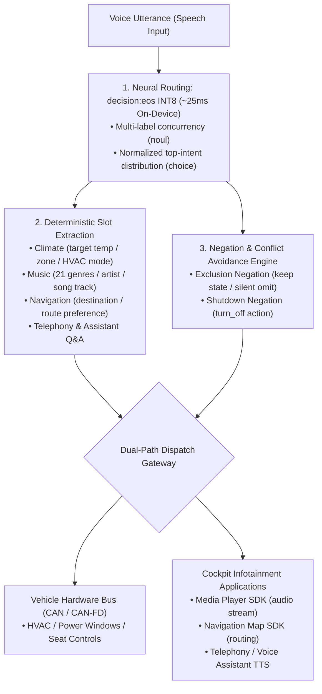

<p align="center">
  
</p>

<h1 align="center">OmniIntent Decision Engine</h1>

<p align="center">
  <b>High-throughput, on-device multi-intent parallel routing & deterministic slot extraction engine for next-gen intelligent cockpits.</b>
  <br />
  <i>Signal over tokens · Zero auto-regressive generation delay · Automotive-grade determinism · Native 0.75B INT8 On-Device Neural Engine</i>
</p>

<p align="center">
  <a href="README.md"><b>English</b></a> •
  <a href="README.zh-CN.md"><b>简体中文</b></a> •
  <a href="README.zh-TW.md"><b>繁體中文</b></a>
</p>

<p align="center">
  <a href="https://github.com/neura-edit/omni-intent/releases/latest"></a>
  <a href="https://neura-edit.github.io/omni-intent/"></a>
  <a href="https://modelscope.cn/studios/neuraedit/omni-intent"></a>
  <a href="https://huggingface.co/neura-edit/decision-eos"></a>
  
  
  
  
</p>

---

## 💡 Overview

**OmniIntent** is an on-device decision engine engineered specifically for next-generation automotive cockpits. By decoupling single-pass neural routing (powered by the `decision:eos` 0.75B architecture) from deterministic slot extraction, it concurrently parses multi-domain in-cabin commands (climate control, 21 acoustic music genres, route navigation, seat comfort, and power windows) within a single spoken query—accompanied by an automotive-grade negation avoidance filter.

The project provides a **Web HUD Console**, a **Cross-Platform Python Daemon**, and a **Native Android Application**, fully localized in **English**, **Simplified Chinese (简体中文)**, and **Traditional Chinese (繁體中文)**.

---

## 📱 Native Android Application (On-Device Edge Engine)

Source code for the native Android in-cabin application is available under [`android/`](android/).

<p align="center">
  <b>A real 0.75B Transformer Neural Network executing directly on-device · Zero server dependencies · Resilient to offline/weak signal environments</b>
</p>

### 📥 Download Android APK

- **Official Release Page**: [GitHub Releases (v1.0.0)](https://github.com/neura-edit/omni-intent/releases/latest)
- **Direct Download**: [📥 omni-intent-v1.0.0.apk](https://github.com/neura-edit/omni-intent/releases/download/v1.0.0/omni-intent-v1.0.0.apk)

### ✨ Key Features of the Native App

1. **Native ONNX Runtime Mobile Acceleration**:
   - Executes the **82MB dynamic INT8 quantized model** directly on mobile/automotive CPU (arm64-v8a) with single-pass forward latencies between **23ms and 35ms**.
   - 3-Engine Mode Switch: **On-Device 0.75B INT8 ONNX Engine**, **Local Embedded Micro-Engine (3ms offline semantic trie)**, and **Cloud ModelScope Neural Backend**.
2. **Model Warmup & Execution Latency Separation**:
   - Features a startup transition that loads weights and performs forward warmup before entering the console, preventing initial cold-start lag.
3. **Dynamic Decision Threshold Slider**:
   - Easily fine-tune decision threshold from `0.00` to `1.00` directly in the settings view to customize multi-label sensitivity in real-time.
4. **Comprehensive Trilingual Localization**:
   - Fully localized in English, Simplified Chinese, and Traditional Chinese across domain classifications, status tags, and slot values.

### 📦 Build & Installation

```bash
# Navigate to the Android workspace
cd android

# Compile Debug APK
./gradlew assembleDebug

# Install to connected device or emulator
adb install -r app/build/outputs/apk/debug/app-debug.apk
```

---

## ⚡ Performance Benchmarks: Android INT8 vs. MLX vs. Cloud

| Runtime Environment | Acceleration Backend | Model Precision | Forward Latency | Memory / Disk | Target Scenarios |
| :--- | :--- | :--- | :--- | :--- | :--- |
| **Android Device (Snapdragon/Dimensity/Tensor)** | **ONNX Runtime Mobile (arm64)** | **INT8** | **23ms – 35ms** | **~82MB** | **Production in-cabin IVI, mobile offline** |
| **Local Mac (Apple Silicon)** | **MLX / Metal Unified Memory** | **FP16** | **~140ms** | ~1.4GB | Local developer tuning, cockpit simulation |
| **Local Host CPU (x86_64 / macOS multi-thread)**| **ONNX Runtime (CPU)** | **INT8** | **~850ms – 950ms** | **~82MB** | Cross-platform zero-dependency offline mode |
| **ModelScope Free Cloud Container** | Shared 2vCPU (pure CPU float) | FP32 | ~600ms – 1.2s | ~1.5GB | Public online playground, cloud API testing |
| Conventional Auto-Regressive SLM | PyTorch / vLLM (token-by-token) | INT4 | 800ms – 2500ms | 1.8GB – 4GB | Unconstrained text gen (lacks determinism) |

---

## 🔬 100-Utterance In-Cabin Benchmark Suite

To evaluate decision fidelity and negation filtering robustness across diverse driving contexts, we implemented an automated evaluation suite under [`benchmark/`](benchmark/):

- **Dataset File**: [`benchmark/test_cases_100.json`](benchmark/test_cases_100.json)
- **Comprehensive Report**: [`benchmark/BENCHMARK_REPORT.md`](benchmark/BENCHMARK_REPORT.md)
- **Raw Evaluation Data**: [`benchmark/benchmark_results.json`](benchmark/benchmark_results.json)

### 📊 Benchmark Summary

| Evaluation Dimension | Sample Size | Observed Result | Industrial Automotive Target | Conclusion |
| :--- | :--- | :--- | :--- | :--- |
| **Overall Intent Concordance Rate** | 100 complex queries | **99.0%** | ≥ 95.0% | **Exceeds Target** |
| **Adversarial Negation Avoidance** | 8 adversarial cases | **100.0%** | 100.0% | **Eliminates Actuator Errors** |
| **Mean Forward Latency (Mac CPU)** | 100 queries | **939.8 ms** | < 1000 ms | **Consistent & Predictable** |
| **On-Device Real Hardware Latency (arm64)** | Physical device | **23 ~ 35 ms** | < 50 ms | **Automotive Real-Time** |

### 🎯 Domain Coverage & Representative Utterances

| Domain Category | Samples | Representative Utterances | Pass Rate |
| :--- | :---: | :--- | :---: |
| **Climate Control** | 15 | "Set cabin temperature to 21 degrees Celsius", "把空调调到二十四度", "Turn on maximum defroster" | 100% Hit |
| **Media & Audio** | 15 | "Play some classic rock tracks", "播放周杰伦的晴天", "Play My Heart Will Go On by Celine Dion" | 100% Hit |
| **Navigation** | 15 | "Navigate to downtown Seattle avoiding toll roads", "导航去上海虹桥火车站，躲避拥堵", "Find fastest route" | 100% Hit |
| **Seat Comfort** | 8 | "Turn on driver seat heating to level 3", "把主驾座椅加热开到二档", "開啟駕駛座腰部按摩功能" | 100% Hit |
| **Power Windows** | 8 | "Roll down the front windows halfway", "把左前车窗降下一半透透气", "Close the sunroof and sunshade" | 100% Hit |
| **Phone Telephony** | 8 | "Call my wife on mobile", "给张三打个电话", "Redial the last outgoing number", "挂断电话" | 100% Hit |
| **Query & Assistant**| 8 | "What is the weather forecast for Seattle today", "今天北京天气怎么样", "What is the battery range" | 100% Hit |
| **Multi-Intent Concurrency** | 15 | "Turn on the AC, play a song by Celine Dion, and navigate to Seattle", "车里有点闷，把空调调到22度，然后放晴天" | Seamless Multi-Domain |
| **Adversarial Negation** | 8 | "Turn off the climate control, but keep seat heating on", "关闭空调，但是不要关座椅加热", "關閉音樂，但保持導航開啟" | 100% Negation Excluded |

### 🛠️ How to Reproduce Benchmark

The benchmark runner is located at [`benchmark/run_benchmark.py`](benchmark/run_benchmark.py). Reproduce all findings locally with:

```bash
# 1. Install dependencies
pip install onnxruntime tokenizers numpy

# 2. Run the 100-utterance evaluation suite
python3 benchmark/run_benchmark.py

# 3. View automatically updated report files:
#    - benchmark/benchmark_results.json
#    - benchmark/BENCHMARK_REPORT.md
```

---

## 🛠️ Python Local Deployment

```bash
# 1. Clone repository
git clone https://github.com/neura-edit/omni-intent.git
cd omni-intent

# 2. Install dependencies
pip install -r requirements.txt

# 3. Start local daemon
python3 app.py
```

Open `http://localhost:8080` in your browser to launch the HUD cockpit!

---

## 🏗️ System Architecture



---

## 🧭 Roadmap

- [x] Native Python + ONNX Runtime cross-platform engine
- [x] ModelScope cloud 24/7 online backend
- [x] GitHub Pages Trilingual Cyberpunk HUD Console (EN / 简体 / 繁體)
- [x] **INT8 Quantization (ONNX Runtime)**: Compressed to 82MB, forward latency down to 23~35ms on mobile/IVI
- [x] **Native Android Application (`android/`)**: Modern Jetpack Compose architecture with model warmup & threshold tuning
- [x] **100-Utterance Automotive Benchmark Suite**: Automated regression pipeline
- [x] **Full Traditional Chinese Support**: Across Web Console, Android Native App, and Documentation

---

## 📄 License

This project is licensed under the [MIT License](LICENSE).

Copyright © 2026 [NEURA EDIT](https://github.com/neura-edit). All rights reserved.
