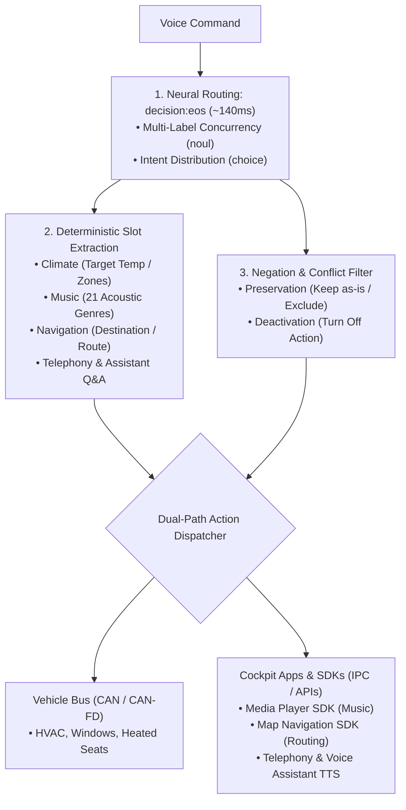

<p align="center">
  
</p>

<h1 align="center">OmniIntent Decision Engine</h1>

<p align="center">
  <b>High-throughput on-device multi-intent routing & deterministic slot extraction for automotive cockpits.</b>
  <br />
  <i>Signal over tokens.</i>
</p>

<p align="center">
  <a href="README.md"><b>English</b></a> •
  <a href="README.zh-CN.md"><b>简体中文</b></a>
</p>

<p align="center">
  <a href="https://modelscope.cn/studios/neuraedit/omni-intent"></a>
  <a href="https://huggingface.co/neura-edit/decision-eos"></a>
  
  
</p>

---

## Overview

**OmniIntent** is an on-device decision engine designed for next-generation automotive voice intelligence. By coupling single-pass forward neural routing (`decision:eos`) with deterministic slot extraction, it processes compound, multi-domain voice commands in **~140ms** without autoregressive generation latency, token waste, or hallucination risks.

### 🚀 Live Cloud Demo (Out-of-the-Box)
Experience the full-featured interactive cockpit HUD without installing anything locally:
- **Interactive Cloud Web HUD (ModelScope)**: [https://modelscope.cn/studios/neuraedit/omni-intent](https://modelscope.cn/studios/neuraedit/omni-intent)
- **Official Model Hub (Hugging Face)**: [https://huggingface.co/neura-edit/decision-eos](https://huggingface.co/neura-edit/decision-eos)



## Key Capabilities

- **Multi-Intent Concurrency**: Parses compound instructions (e.g. climate + music + navigation) simultaneously in a single pass.
- **Deterministic Slot Extraction**: Pure regex and trie extractors for target temperatures, cabin zones, 21 acoustic genres, route preferences, and contacts.
- **Bipartite Negation Resolution**: Distinguishes preservation intents (*"leave seats alone"*) from deactivation intents (*"turn off the AC"*).
- **Zero External Dependencies**: Implemented entirely with the Python 3 standard library (`http.server`, `urllib`, `re`, `json`).
- **Real-Time Inspection HUD**: Bilingual (EN/ZH) interactive web dashboard with latency telemetry and dynamic domain configuration.

## Quickstart

### Prerequisites
- Python >= 3.8
- [Ollaya](https://ollaya.dev) running on port `11435` with `decision:eos`

```bash
# 1. Pull decision model (~1.5GB)
ollaya pull decision:eos

# 2. Launch engine
python3 app.py

# 3. Open dashboard
http://localhost:8080
```

## API Reference

### `POST /api/decide`
Evaluates natural language commands and returns routed intents, slot parameters, and execution actions.

#### Request
```json
{
  "text": "Turn off the AC, play some jazz, but do not touch heated seats",
  "lang": "en"
}
```

#### Response
```json
{
  "ok": true,
  "intent": {
    "choice": "music",
    "probabilities": { "music": 0.65, "climate": 0.35, "seat": 0.0 }
  },
  "domains": { "climate": 0.88, "music": 0.94, "seat": 0.82 },
  "negation": {
    "exclusions": ["seat"],
    "turn_offs": ["climate"],
    "turn_ons": ["music"]
  },
  "domain_actions": {
    "climate": { "action": "turn_off", "label": "关闭/停止 (Turn Off)" },
    "music": { "action": "turn_on", "label": "开启/调节 (Turn On)" },
    "seat": { "action": "exclude", "label": "维持现状/排除 (Excluded/Ignore)" }
  },
  "timing": {
    "wall_ms": 138.4,
    "model_ms": 126.1,
    "input_tokens": 128
  }
}
```

### `GET /api/config`
Retrieves active domain taxonomy configuration (`config.json`).

## Technical Benchmark

| Metric | Autoregressive SLM (0.5B~1.5B) | Conventional NLU | OmniIntent Engine |
| :--- | :--- | :--- | :--- |
| **Latency** | 800ms – 2500ms | 30ms – 60ms | **~140ms** (FP32) / **~35ms** (INT8) |
| **Multi-Intent** | Yes (token sequential) | ❌ Single intent only | **Native concurrent routing** |
| **Reliability** | Prone to JSON parse crashes | High | **100% deterministic schema** |
| **Negation Logic**| Frequent hallucination | Weak keyword hits | **Deterministic 2-state resolution** |
| **Runtime Env** | PyTorch / Heavy CUDA deps | Scikit-learn / SpaCy | **Zero dependencies (Standard Lib)** |

## License

MIT © [NEURA EDIT](https://github.com/neura-edit)
