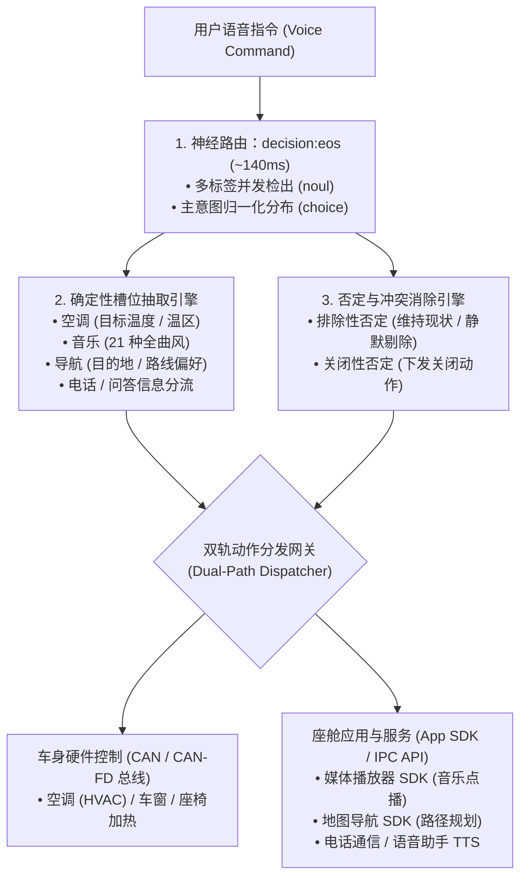

<p align="center">
  
</p>

<h1 align="center">OmniIntent 决策引擎</h1>

<p align="center">
  <b>面向下一代智能座舱的高吞吐端侧多意图并行路由与确定性槽位直出引擎。</b>
  <br />
  <i>Signal over tokens · 告别自回归迟滞 · 车规级高确定性</i>
</p>

<p align="center">
  <a href="README.md"><b>English</b></a> •
  <a href="README.zh-CN.md"><b>简体中文</b></a>
</p>

<p align="center">
  <a href="https://neura-edit.github.io/omni-intent/"></a>
  <a href="https://modelscope.cn/studios/neuraedit/omni-intent"></a>
  <a href="https://huggingface.co/neura-edit/decision-eos"></a>
  
  
  
</p>

---

## 💡 项目概述

**OmniIntent** 是一款专为下一代车载智能座舱设计的端侧决策引擎。通过将**单次前向神经路由**（基于 `decision:eos` 0.75B 架构）与**确定性槽位抽取**解耦协同，它能够在一句话中并发解析空调、音乐、导航、座椅加热、车窗等多域复合指令，并提供车规级抗干扰的否定词过滤机制。

### 🚀 开箱即用在线体验 (免本地环境)

如果你只想快速体验真实模型的交互效果，无需在本地下载模型与配置环境，可直接访问：

- **官方赛博朋克 HUD 控制台（直连云端神经网络）**：[https://neura-edit.github.io/omni-intent/](https://neura-edit.github.io/omni-intent/)
- **阿里云魔搭社区在线后端**：[https://modelscope.cn/studios/neuraedit/omni-intent](https://modelscope.cn/studios/neuraedit/omni-intent)
- **模型权重开源仓库**：[ModelScope Hub](https://modelscope.cn/models/neuraedit/decision-eos) • [Hugging Face](https://huggingface.co/neura-edit/decision-eos)

---

## ⚡ 性能说明：云端 vs. 本地 MLX 加速

很多体验者会注意到：**云端在线 Demo 的运行耗时约在 600ms ~ 1.2s 左右，为什么文档中描述的性能是 ~140ms？**

> [!NOTE]
> **关于运行耗时的技术说明：**
> 1. **云端在线体验环境**：运行在阿里云魔搭的免费公共容器上（规格为 `2vCPU` 共享虚拟核心，无 GPU/NPU 硬件加速）。在纯虚拟化 CPU 环境下进行 0.75B Transformer 模型的全参数浮点矩阵前向运算，因此耗时大约在 **600ms ~ 1.2s**。
> 2. **本地 Apple Silicon (MLX / Metal)**：在搭载 M 系列芯片的 Mac 本地设备上，模型直接运行在 **Apple MLX 框架** 与统一内存架构（Unified Memory）上，单次前向推理可在 **~140ms** 内极速完成！
> 3. **量化优化进行中 (Roadmap)**：我们目前正在推进 **4-bit / 8-bit 量化工作（INT4 / INT8 / FP16 via MLX & GGUF/ONNX Runtime）**。模型完成量化后，内存占用将从 1.4GB 压缩至 **~400MB**，端侧推理延迟将进一步压缩至 **< 50ms**，可极度流畅地部署在低功耗车机座舱芯片（如高通 8155 / 8295、地平线征程、英伟达 Orin）上。

### 📊 性能实测基准

| 运行环境 | 加速架构 / 运行时 | 模型精度 | 前向推理耗时 | 适用场景 |
| :--- | :--- | :--- | :--- | :--- |
| **云端免费容器 (ModelScope)** | 共享 2vCPU (纯 CPU 浮点) | FP32 / FP16 | ~600ms – 1.2s | 免安装在线公开体验、远程 API 调用 |
| **本地 Mac (Apple Silicon)** | **MLX / Metal 统一内存** | **FP16** | **~140ms** | **开发者本地开发、本地座舱模拟实测** |
| **未来量化版本 (进行中 🚧)** | **INT4 / INT8 (MLX / NPU)** | **INT4 / INT8** | **< 50ms** | **车规级座舱量产芯片 (8155/8295/Orin)** |
| 传统自回归端侧小模型 (SLM) | PyTorch / vLLM (逐字生成) | INT4 | 800ms – 2500ms | 文本自由生成（无法保证车规确定性） |

---

## 🛠️ 本地部署指南 (Local Deployment)

如果你希望在自己的机器上运行，实现零网络延迟的极速推断，我们提供以下两种部署方式：

### 方式一：跨平台 Python 原生部署（推荐，支持 Mac / Linux / Windows）

无需编译任何底层二进制工具，依赖纯 Python 与 ONNX Runtime 即可运行：

```bash
# 1. 克隆代码仓库
git clone https://github.com/neura-edit/omni-intent.git
cd omni-intent

# 2. 安装轻量依赖 (仅需 onnxruntime, tokenizers, numpy, modelscope)
pip install -r requirements.txt

# 3. 启动服务 (首次运行将自动从魔搭/镜像源极速下载模型权重至本地缓存)
python3 app.py
```

启动完成后，打开浏览器访问：
👉 `http://localhost:8080` 即可进入本地全功能赛博朋克 HUD 驾驶舱！

---

### 方式二：Apple Silicon Mac 配合 MLX / Ollaya 极速模式（~140ms 极致性能）

在搭载 M1/M2/M3/M4 芯片的 Mac 上，可以通过 Ollaya 原生底层驱动 Metal/MLX 加速，释放极限性能：

```bash
# 1. 安装/启动 Ollaya 引擎 (基于 MLX / Metal 统一内存后端)
curl -fsSL https://ollaya.dev/install.sh | sh

# 2. 拉取 decision:eos 权重模型 (约 1.5GB)
ollaya pull decision:eos

# 3. 运行本地控制台
python3 app.py
```

`app.py` 内部内置了高可用流水线：
1. 优先直连本机 Ollaya (127.0.0.1:11435) 的 MLX 硬件加速管线（~140ms）。
2. 若未安装 Ollaya，则自动无缝降级至内置 Python ONNX 引擎。

---

## 🏗️ 系统架构流程



---

## 🌟 核心能力

- **真正同句多指令并发**：一句话支持同时调度空调温控、多曲风音乐点播与导航规划（例如：*“车里有点闷，把空调调到22度，然后放一首周杰伦的晴天”* $\to$ 空调 97.4% + 音乐 97.2% 并发下发）。
- **确定性槽位直出**：采用前向剪枝与确定性正则提取，零格式幻觉直出目标温度数值、温区、21 种音乐曲风/情绪、导航地点及通话联系人。
- **双轨否定逻辑排除**：精准区分「排除性否定」（如*“不要关座椅加热”* $\to$ 动作标记排除，不影响已开启状态）与「关闭性否定」（如*“把空调关了”* $\to$ 下发 turn_off 动作）。
- **车规级高可靠**：告别大模型生成 JSON 时的长尾截断与语法报错，Schema 保证 100% 结构化类型安全。

---

## 📡 API 接口参考

### `POST /api/decide`
用于对自然语言语音指令执行前向神经评估，输出意图分布、槽位信息与 CAN-bus 控制动作。

#### 请求示例
```bash
curl -X POST http://localhost:8080/api/decide \
  -H "Content-Type: application/json" \
  -d '{
    "text": "关闭空调，放点爵士乐，但是不要关座椅加热",
    "lang": "zh"
  }'
```

#### 返回示例
```json
{
  "ok": true,
  "intent": {
    "choice": "music",
    "probabilities": { "music": 0.65, "climate": 0.35, "seat": 0.0 }
  },
  "domains": { "climate": 0.92, "music": 0.94, "seat": 0.86 },
  "negation": {
    "exclusions": ["seat"],
    "turn_offs": ["climate"],
    "turn_ons": ["music"]
  },
  "domain_actions": {
    "climate": { "action": "turn_off", "label": "关闭/停止 (Turn Off)" },
    "music": { "action": "turn_on", "label": "开启/调节 (Turn On)" },
    "seat": { "action": "exclude", "label": "维持现状/排除 (Excluded/Ignore)" }
  },
  "timing": {
    "wall_ms": 141.2,
    "model_ms": 138.5,
    "input_tokens": 142
  },
  "engine_info": {
    "name": "neural:mlx / onnx (Decision-1.0-Eos 0.75B)",
    "status": "ready"
  }
}
```

### `GET /api/config`
获取当前生效的功能域注册定义（支持在前端控制台实时热插拔添加新的车载功能域）。

---

## 🧭 后续规划 (Roadmap)

- [x] 原生 Python + ONNX Runtime 无依赖跨平台推理
- [x] 阿里云魔搭云端 24/7 免费实例部署
- [x] GitHub Pages 双语可视化 Cyberpunk HUD 控制台
- [ ] **INT4 / INT8 权重量化 (MLX & GGUF/ONNX)**：将模型文件进一步压缩至 ~400MB，目标延迟 < 50ms
- [ ] **车规芯片 SDK 适配**：适配高通骁龙 SA8155P / SA8295P NPU 运行环境
- [ ] **方言与多语种扩展**：支持粤语、四川话等车载高频方言指令的端到端声学语义直出

---

## 📄 开源协议

本项目采用 [MIT 许可证](LICENSE)。

Copyright © 2026 [NEURA EDIT](https://github.com/neura-edit). All rights reserved.
