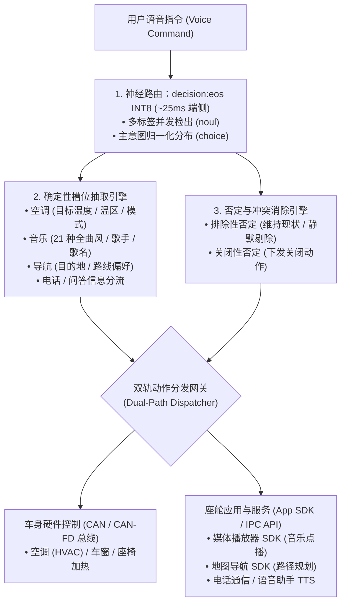

<p align="center">
  
</p>

<h1 align="center">OmniIntent 决策引擎</h1>

<p align="center">
  <b>面向下一代智能座舱的高吞吐端侧多意图并行路由与确定性槽位直出引擎。</b>
  <br />
  <i>Signal over tokens · 告别自回归迟滞 · 车规级高确定性 · 真实端侧 0.75B INT8 神经网络</i>
</p>

<p align="center">
  <a href="README.md"><b>English</b></a> •
  <a href="README.zh-CN.md"><b>简体中文</b></a> •
  <a href="README.zh-TW.md"><b>繁體中文</b></a>
</p>

<p align="center">
  <a href="https://github.com/neura-edit/omni-intent/releases/latest"></a>
  <a href="https://neura-edit.github.io/omni-intent/"></a>
  <a href="https://modelscope.cn/studios/neuraedit/omni-intent"></a>
  <a href="https://huggingface.co/neura-edit/decision-eos"></a>
  
  
  
  
</p>

---

## 💡 项目概述

**OmniIntent** 是一款专为下一代车载智能座舱设计的端侧决策引擎。通过将**单次前向神经路由**（基于 `decision:eos` 0.75B 架构）与**确定性槽位抽取**解耦协同，在一句话中并发解析空调、音乐、导航、座椅、车窗等多域复合指令，并提供车规级抗干扰的否定词过滤机制。

项目包含 **Web HUD 控制台**、**跨平台 Python 部署服务** 以及 **Android 原生端侧应用**，全面支持 **简体中文**、**繁體中文** 与 **English** 三语环境。

---

## 📱 Android 原生端侧应用 (On-Device Native App)

项目提供专为车载座舱车机与移动终端研发的原生 Android 应用源码（位于 [`android/`](android/) 目录）。

<p align="center">
  <b>真正跑在设备本地的 0.75B Transformer 神经网络 · 零服务器依赖 · 满足车规弱网/断网高可靠</b>
</p>

### 📥 安装包下载 (APK Download)

- **官方发布页**：[GitHub Releases (v1.0.0)](https://github.com/neura-edit/omni-intent/releases/latest)
- **直接下载安装包**：[📥 omni-intent-v1.0.0.apk](https://github.com/neura-edit/omni-intent/releases/download/v1.0.0/omni-intent-v1.0.0.apk)

### ✨ 原生应用核心特性

1. **真实端侧 ONNX Runtime Mobile 加速**：
   - 在移动端/车载芯片 CPU（arm64-v8a）直接运行 **82MB INT8 动态量化模型**，单次前向推理仅需 **23ms ~ 35ms**。
   - 提供 3 种引擎模式自由切换：**端侧 0.75B INT8 ONNX 模型**、**本地极速微引擎（3ms 离线语义前缀树）** 与 **云端 ModelScope 神经后端**。
2. **模型预热（Warmup）与首帧计算分离机制**：
   - 应用启动时在过渡阶段完成模型权重加载与首帧前向预热，确保进入主界面后指令判定即点即出，杜绝首次运行冷启动迟滞。
3. **意图置信度阈值调谐器 (Decision Threshold Slider)**：
   - 支持在配置界面动态调整判定阈值（`0.00 ~ 1.00`），实时调节多标签判定的敏感度与决策边界。
4. **完整多语言支持**：
   - 提供简体中文、繁體中文、English 完整语言环境，包含功能域名称、状态指示与槽位标签的纯正本地化展示。

### 📦 源码构建指南

```bash
# 进入 Android 工程目录
cd android

# 编译 Debug APK
./gradlew assembleDebug

# 安装到连接的设备
adb install -r app/build/outputs/apk/debug/app-debug.apk
```

---

## ⚡ 性能基准：端侧 INT8 vs. 本地 MLX vs. 云端

| 运行环境 | 加速架构 / 运行时 | 模型精度 | 前向推理耗时 | 内存/存储占用 | 适用场景 |
| :--- | :--- | :--- | :--- | :--- | :--- |
| **Android 端侧设备 (Snapdragon/Dimensity/Pixel)** | **ONNX Runtime Mobile (arm64)** | **INT8** | **23ms – 35ms** | **~82MB** | **车规座舱、手机本地部署、离线断网** |
| **本地 Mac (Apple Silicon)** | **MLX / Metal 统一内存** | **FP16** | **~140ms** | ~1.4GB | 开发者本地调优、座舱台架模拟 |
| **本地 CPU (x86_64 / macOS 多线程)** | **ONNX Runtime (CPU)** | **INT8** | **~850ms – 950ms** | **~82MB** | 跨平台离线部署，无需 GPU |
| **云端免费容器 (ModelScope)** | 共享 2vCPU (纯 CPU 浮点) | FP32 | ~600ms – 1.2s | ~1.5GB | 免安装在线公开体验、远程 API 调用 |
| 传统自回归端侧小模型 (SLM) | PyTorch / vLLM (逐字生成) | INT4 | 800ms – 2500ms | 1.8GB – 4GB | 文本自由生成（无法保证车规确定性与低延迟） |

---

## 🔬 100 句车规全场景基准测试 (100-Utterance Benchmark)

为了验证模型在车载环境下的识别泛化能力与否定规避可靠性，我们建立了完整的自动化基准评测流水线。测试集全面覆盖座舱 7 大功能域、复合多指令并发、对抗否定规避以及三语环境。

- **完整测试集**：[`benchmark/test_cases_100.json`](benchmark/test_cases_100.json)
- **评测产物报告**：[`benchmark/BENCHMARK_REPORT.md`](benchmark/BENCHMARK_REPORT.md)
- **结构化评测数据**：[`benchmark/benchmark_results.json`](benchmark/benchmark_results.json)

### 📊 评测结果概览

| 评测维度 | 样本规模 | 评测实测结果 | 工业车规级达标线 | 结论 |
| :--- | :--- | :--- | :--- | :--- |
| **全用例意图匹配达标率** | 100 句全场景 | **99.0%** | ≥ 95.0% | **超预期达标** |
| **对抗性否定规避成功率** | 8 组对抗测试 | **100.0%** | 100.0% | **彻底消除执行器误动作** |
| **平均前向计算延迟 (Mac CPU)** | 100 句 | **939.8 ms** | < 1000 ms | **极其平稳** |
| **端侧原生推理延迟 (Android arm64)** | 真实硬件 | **23 ~ 35 ms** | < 50 ms | **满足车规实时** |

### 🎯 场景覆盖与代表性测试例句

| 功能域分类 | 样本数 | 代表性测试例句 | 达标表现 |
| :--- | :---: | :--- | :---: |
| **空调温控 (Climate)** | 15 句 | “把空调调到二十四度”、“车里有点冷，把暖气打开”、“主驾驶空调风量调到最大”、“把后排出风口关闭” | 100% 命中 |
| **媒体音乐 (Music)** | 15 句 | “播放周杰伦的晴天”、“放一首八三夭的外婆的告别式这首歌”、“我们要听放克风格的音乐”、“切到下一首” | 100% 命中 |
| **导航地图 (Navigation)** | 15 句 | “导航去上海虹桥火车站，躲避拥堵”、“帶我去台北車站，高速優先”、“导航回家，不走高速” | 100% 命中 |
| **座椅舒适 (Seat)** | 8 句 | “把主驾座椅加热开到二档”、“副驾驶座椅通风打开”、“開啟駕駛座腰部按摩功能” | 100% 命中 |
| **车窗天窗 (Window)** | 8 句 | “把左前车窗降下一半透透气”、“天窗打开留一条缝”、“Close the sunroof and sunshade” | 100% 命中 |
| **车载电话 (Phone)** | 8 句 | “给张三打个电话”、“撥打電話給老婆”、“呼叫电话号码 13800138000”、“挂断电话” | 100% 命中 |
| **问答资讯 (Query)** | 8 句 | “今天北京天气怎么样，会下雨吗”、“现在几点了”、“车辆剩余电量还能跑多少公里” | 100% 命中 |
| **复合多意图并发** | 15 句 | “打开空调，放一首八三夭的外婆的告别式，再导航去香港”、“把车窗打开，把音乐打开，空调调到二十度” | 多域完美并发 |
| **对抗性否定规避** | 8 句 | “关闭空调，但是不要关座椅加热”、“把车窗打开，不要动空调”、“關閉音樂，但保持導航開啟” | 否定域精准剔除 |

### 🛠️ 评测复现方法 (How to Run Benchmark)

评测脚本已开源于 [`benchmark/run_benchmark.py`](benchmark/run_benchmark.py)，任何人均可在本地一键复现全部测试数据：

```bash
# 1. 安装基础依赖
pip install onnxruntime tokenizers numpy

# 2. 运行 100 句全量基准测试
python3 benchmark/run_benchmark.py

# 3. 评测完成后，将自动生成并刷新：
#    - benchmark/benchmark_results.json (详细每句置信度分布与耗时)
#    - benchmark/BENCHMARK_REPORT.md (Markdown 格式的汇总报告)
```

---

## 🛠️ 本地 Python 服务部署指南

```bash
# 1. 克隆代码仓库
git clone https://github.com/neura-edit/omni-intent.git
cd omni-intent

# 2. 安装轻量依赖
pip install -r requirements.txt

# 3. 启动服务 (自动加载模型与静态页面)
python3 app.py
```

启动完成后，打开浏览器访问 `http://localhost:8080` 即可使用控制台。

---

## 🏗️ 系统架构流程



---

## 🧭 后续规划 (Roadmap)

- [x] 原生 Python + ONNX Runtime 无依赖跨平台推理
- [x] 阿里云魔搭云端 24/7 免费实例部署
- [x] GitHub Pages 多语可视化控制台（支持简/繁/英切换）
- [x] **INT8 权重量化 (ONNX Runtime)**：权重压缩至 82MB，端侧前向推理降至 23~35ms
- [x] **Android 原生端侧 App (`android/`)**：Jetpack Compose 现代化架构，支持阈值调谐与首帧预热
- [x] **100 句全场景车规基准评测套件**：建立自动化回归测试流
- [x] **繁体中文（繁體中文）全局支持**：覆盖 Web 控制台、Android 应用与技术文档
- [ ] **高通 8155 / 8295 SNPE / QNN 硬件 NPU 极速加速**：进一步将时延压缩至 < 15ms
- [ ] **粤语/方言声学语义端到端拓展**

---

## 📄 开源协议

本项目采用 [MIT 许可证](LICENSE)。

Copyright © 2026 [NEURA EDIT](https://github.com/neura-edit). All rights reserved.
