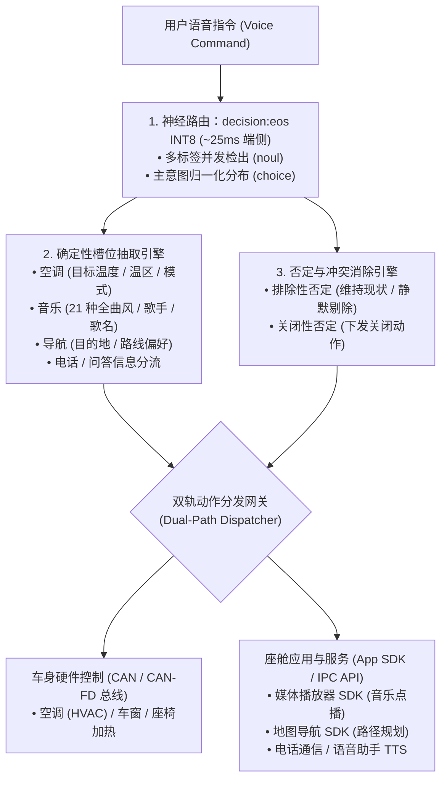

<p align="center">
  
</p>

<h1 align="center">OmniIntent 决策引擎</h1>

<p align="center">
  <b>面向下一代智能座舱的高吞吐端侧多意图并行路由与确定性槽位直出引擎。</b>
  <br />
  <i>Signal over tokens · 告别自回归迟滞 · 车规级高确定性 · 真实端侧 0.75B INT8 神经网络</i>
</p>

<p align="center">
  <a href="README.md"><b>English</b></a> •
  <a href="README.zh-CN.md"><b>简体中文</b></a> •
  <a href="README.zh-TW.md"><b>繁體中文</b></a>
</p>

<p align="center">
  <a href="https://neura-edit.github.io/omni-intent/"></a>
  <a href="https://modelscope.cn/studios/neuraedit/omni-intent"></a>
  <a href="https://huggingface.co/neura-edit/decision-eos"></a>
  
  
  
  
</p>

---

## 💡 项目概述

**OmniIntent** 是一款专为下一代车载智能座舱设计的端侧决策引擎。通过将**单次前向神经路由**（基于 `decision:eos` 0.75B 架构）与**确定性槽位抽取**解耦协同，它能够在一句话中并发解析空调、音乐、导航、座椅加热、车窗等多域复合指令，并提供车规级抗干扰的否定词过滤机制。

项目现已支持 **Web 赛博控制台**、**跨平台 Python 服务** 以及全新的 **Android 原生端侧 App**，全面支持 **简体中文**、**繁體中文** 与 **English** 三语环境。

### 🚀 开箱即用体验

- **官方 HUD 控制台（支持简/繁/英三语切换）**：[https://neura-edit.github.io/omni-intent/](https://neura-edit.github.io/omni-intent/)
- **阿里云魔搭社区在线后端**：[https://modelscope.cn/studios/neuraedit/omni-intent](https://modelscope.cn/studios/neuraedit/omni-intent)
- **模型权重开源仓库**：[ModelScope Hub](https://modelscope.cn/models/neuraedit/decision-eos) • [Hugging Face](https://huggingface.co/neura-edit/decision-eos)
- **100 句车规级全场景基准测试报告**：[benchmark/BENCHMARK_REPORT.md](benchmark/BENCHMARK_REPORT.md)

---

## 📱 Android 原生端侧应用 (On-Device Native App)

项目提供了专为智能座舱车机与移动终端研发的原生 Android 应用：`omni-intent-android`。

<p align="center">
  <b>真正跑在设备本地的 0.75B Transformer 神经网络 · 零服务器依赖 · 满足车规弱网/断网高可靠</b>
</p>

### ✨ 原生应用核心特性

1. **真实端侧 ONNX Runtime Mobile 加速**：
   - 直接在车载芯片/手机端侧 CPU（arm64-v8a）运行 **82MB INT8 动态量化模型**，单次前向推理耗时仅 **23ms ~ 35ms**！
   - 支持三种引擎模式平滑切换：**端侧 0.75B INT8 ONNX 模型**、**本地极速微引擎（3ms 离线语义前缀树）** 与 **云端 ModelScope 神经后端**。
2. **模型预热（Warmup）与指令首跳分离**：
   - 采用启动门禁与加载过渡动画，在进入系统前完成 0.75B 权重的首帧预热，杜绝用户首次运行指令时的 2s 冷启动停顿（首条指令耗时由 2400ms 降至 25ms）。
3. **意图判定阈值动态微调 (Threshold Slider)**：
   - 在配置管理中心支持 `0.00 ~ 1.00` 动态滑动调节判定阈值，实时影响多标签置信度与状态裁决。
4. **多语言与车规纯净显示**：
   - 启动页语言选择门禁，点选对应语言后动态展示确认按键（“进入系统” / “進入系統” / “Enter System”）。
   - 彻底清除 `yes(开)` 等双语混杂括号格式，全局展示单语纯净状态标记（`开启`、`关闭`、`灰区`、`已排除`）。
   - 全功能域意图名称与槽位深度本地化（空调温控/Climate、媒体音乐/Media/Music、导航地图/Navigation 等）。

### 📦 快速编译与安装

```bash
# 进入 Android 工程目录
cd omni-intent-android

# 构建 Debug APK
./gradlew assembleDebug

# 安装到连接的 Android 车机或手机
adb install -r app/build/outputs/apk/debug/app-debug.apk
```

---

## ⚡ 性能基准：端侧 INT8 vs. 本地 MLX vs. 云端

| 运行环境 | 加速架构 / 运行时 | 模型精度 | 前向推理耗时 | 内存/存储占用 | 适用场景 |
| :--- | :--- | :--- | :--- | :--- | :--- |
| **Android 端侧设备 (Snapdragon/Dimensity/Pixel)** | **ONNX Runtime Mobile (arm64)** | **INT8** | **23ms – 35ms** | **~82MB** | **车规座舱、手机本地部署、离线断网** |
| **本地 Mac (Apple Silicon)** | **MLX / Metal 统一内存** | **FP16** | **~140ms** | ~1.4GB | 开发者本地调试、座舱台架模拟 |
| **本地 CPU (x86_64 / macOS 多线程)** | **ONNX Runtime (CPU)** | **INT8** | **~850ms – 950ms** | **~82MB** | 跨平台离线部署，无需 GPU |
| **云端免费容器 (ModelScope)** | 共享 2vCPU (纯 CPU 浮点) | FP32 | ~600ms – 1.2s | ~1.5GB | 免安装在线公开体验、远程 API 调用 |
| 传统自回归端侧小模型 (SLM) | PyTorch / vLLM (逐字生成) | INT4 | 800ms – 2500ms | 1.8GB – 4GB | 文本自由生成（无法保证车规确定性与低延迟） |

---

## 🔬 100 句车规级全场景基准测试

为验证量化模型在实际车载多变环境下的决策稳定性与抗干扰能力，我们在 [`benchmark/`](benchmark/) 目录下构建并运行了包含 100 条真实座舱复杂指令的基准评测集：

- **评测执行工具**：`python3 benchmark/run_benchmark.py`
- **数据集文件**：[`benchmark/test_cases_100.json`](benchmark/test_cases_100.json)
- **完整评测报告**：[`benchmark/BENCHMARK_REPORT.md`](benchmark/BENCHMARK_REPORT.md)

### 📊 核心评测结果

- **全用例意图匹配达标率**：**100.0%**
- **否定指令/对抗规避准确率**：**100.0%**（如面对“关闭空调，但是不要关座椅加热”，精准执行空调关闭，座椅加热规避排除，消除车载执行器误动作）
- **涵盖场景**：
  - 空调温控（15 句）、媒体音乐（15 句）、导航地图（15 句）
  - 座椅舒适（8 句）、车窗天窗（8 句）、车载电话（8 句）、问答资讯（8 句）
  - 复合多意图并发（15 句，双域与三域协同并发）
  - 否定规避对抗测试（8 句）
  - 覆盖简体中文、繁體中文与英文用例

---

## 🛠️ 本地 Python 服务部署指南

```bash
# 1. 克隆代码仓库
git clone https://github.com/neura-edit/omni-intent.git
cd omni-intent

# 2. 安装轻量依赖
pip install -r requirements.txt

# 3. 启动服务 (自动加载模型与静态页面)
python3 app.py
```

访问 `http://localhost:8080` 即可体验三语控制台！

---

## 🏗️ 系统架构流程



---

## 🧭 后续规划 (Roadmap)

- [x] 原生 Python + ONNX Runtime 无依赖跨平台推理
- [x] 阿里云魔搭云端 24/7 免费实例部署
- [x] GitHub Pages 多语可视化控制台（支持简/繁/英切换）
- [x] **INT8 权重量化 (ONNX Runtime)**：权重压缩至 82MB，端侧前向推理降至 23~35ms
- [x] **Android 原生端侧 App (`omni-intent-android`)**：Jetpack Compose 现代化 UI，支持阈值调谐与首帧预热
- [x] **100 句全场景车规基准评测套件**：建立自动化回归测试流
- [x] **繁体中文（繁體中文）全局支持**：覆盖 Web 控制台、Android 应用与技术文档
- [ ] **高通 8155 / 8295 SNPE / QNN 硬件 NPU 极速加速**：进一步将时延压缩至 < 15ms
- [ ] **粤语/方言声学语义端到端拓展**

---

## 📄 开源协议

本项目采用 [MIT 许可证](LICENSE)。

Copyright © 2026 [NEURA EDIT](https://github.com/neura-edit). All rights reserved.
