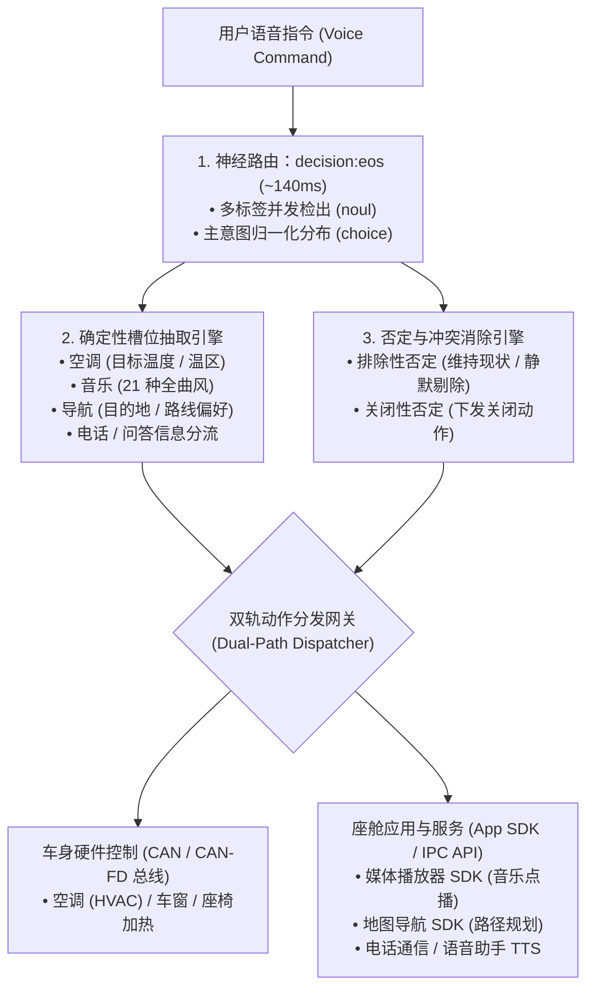

<p align="center">
  
</p>

<h1 align="center">OmniIntent 决策引擎</h1>

<p align="center">
  <b>面向智能座舱的高吞吐端侧多意图并行路由与确定性槽位直出引擎。</b>
  <br />
  <i>Signal over tokens.</i>
</p>

<p align="center">
  <a href="README.md"><b>English</b></a> •
  <a href="README.zh-CN.md"><b>简体中文</b></a>
</p>

<p align="center">
  
  
  
  
</p>

---

## 项目概述

**OmniIntent** 是一款专为下一代车载智能座舱设计的端侧决策引擎。通过将单次前向神经路由（基于 `decision:eos` 模型）与确定性槽位抽取解耦协同，可在 **~140ms** 内并发解析一句话中的复合多域指令，彻底消除传统小模型逐字生成的迟滞、Token 浪费与格式幻觉。



## 核心特性

- **真正同句多指令并发**：一句话支持同时调度空调温控、多曲风音乐点播与导航规划。
- **确定性槽位直出**：采用前向剪枝与词典匹配，零幻觉提取温度数值、温区、21 种音乐曲风/情绪、导航地点及通话联系人。
- **双轨否定逻辑解析**：精准区分「排除性否定（如*“不要动座椅加热”*）」与「关闭性否定（如*“把空调关了”*）」。
- **零外部依赖（Zero Dependencies）**：纯 Python 3 标准库（`http.server`, `urllib`, `re`, `json`）实现，无需 `pip install`。
- **内置可视化控制台**：自带中英双语技术 HUD 交互看板，提供耗时遥测监控与功能域热插拔配置。

## 快速上手

### 环境要求
- Python >= 3.8
- 本机运行 [Ollaya](https://ollaya.dev) 守护进程（端口 `11435`）并加载 `decision:eos` 模型

```bash
# 1. 拉取决策模型（约 1.5GB）
ollaya pull decision:eos

# 2. 启动引擎
python3 app.py

# 3. 浏览器访问控制台
http://localhost:8080
```

## API 接口规范

### `POST /api/decide`
输入自然语言文本，输出结构化意图路由概率、槽位解析及 CAN 动作指令。

#### 请求示例
```json
{
  "text": "关闭空调，放点爵士乐，但是不要关座椅加热",
  "lang": "zh"
}
```

#### 返回示例
```json
{
  "ok": true,
  "intent": {
    "choice": "music",
    "probabilities": { "music": 0.65, "climate": 0.35, "seat": 0.0 }
  },
  "domains": { "climate": 0.88, "music": 0.94, "seat": 0.82 },
  "negation": {
    "exclusions": ["seat"],
    "turn_offs": ["climate"],
    "turn_ons": ["music"]
  },
  "domain_actions": {
    "climate": { "action": "turn_off", "label": "关闭/停止 (Turn Off)" },
    "music": { "action": "turn_on", "label": "开启/调节 (Turn On)" },
    "seat": { "action": "exclude", "label": "维持现状/排除 (Excluded/Ignore)" }
  },
  "timing": {
    "wall_ms": 138.4,
    "model_ms": 126.1,
    "input_tokens": 128
  }
}
```

### `GET /api/config`
获取当前生效的功能域注册定义（`config.json`）。

## 技术方案对比

| 对比维度 | 端侧自回归小模型 (SLM) | 传统分类 NLU | OmniIntent 决策引擎 |
| :--- | :--- | :--- | :--- |
| **端到端延迟** | 800ms – 2500ms（逐字等待） | 30ms – 60ms | **~140ms** (FP32) / **~35ms** (INT8) |
| **多意图支持** | 依赖漫长 Token 生成 | ❌ 仅支持单意图分类 | **单次前向多标签原生并发** |
| **输出确定性** | 频繁出现 JSON 截断/格式解析失败 | 较高 | **100% 结构化类型安全** |
| **否定句鲁棒性** | 极易出现幻觉翻转 | 简单关键词匹配 | **确定性双态判定（排除 vs 关闭）** |
| **部署依赖** | PyTorch / Heavy CUDA 运行时 | Scikit-learn / SpaCy | **零第三方依赖（纯 Python 标准库）** |

## 开源协议

MIT © [NEURA EDIT](https://github.com/neura-edit)
