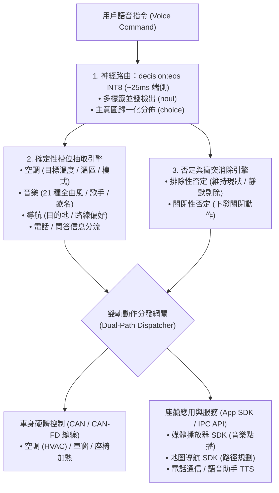

<p align="center">
  
</p>

<h1 align="center">OmniIntent 決策引擎</h1>

<p align="center">
  <b>面向下一代智能座艙的高吞吐端側多意圖並行路由與確定性槽位直出引擎。</b>
  <br />
  <i>Signal over tokens · 告別自回歸遲滯 · 車規級高確定性 · 真實端側 0.75B INT8 神經網絡</i>
</p>

<p align="center">
  <a href="README.md"><b>English</b></a> •
  <a href="README.zh-CN.md"><b>简体中文</b></a> •
  <a href="README.zh-TW.md"><b>繁體中文</b></a>
</p>

<p align="center">
  <a href="https://neura-edit.github.io/omni-intent/"></a>
  <a href="https://modelscope.cn/studios/neuraedit/omni-intent"></a>
  <a href="https://huggingface.co/neura-edit/decision-eos"></a>
  
  
  
  
</p>

---

## 💡 項目概述

**OmniIntent** 是一款專為下一代車載智能座艙設計的端側決策引擎。通過將**單次前向神經路由**（基於 `decision:eos` 0.75B 架構）與**確定性槽位抽取**解耦協同，它能夠在一句話中並發解析空調、音樂、導航、座椅加熱、車窗等多域複合指令，並提供車規級抗干擾的否定詞過濾機制。

項目現已支援 **Web 賽博控制台**、**跨平台 Python 服務** 以及全新的 **Android 原生端側 App**，全面支援 **簡體中文**、**繁體中文** 與 **English** 三語環境。

### 🚀 開箱即用體驗

- **官方 HUD 控制台（支援簡/繁/英三語切換）**：[https://neura-edit.github.io/omni-intent/](https://neura-edit.github.io/omni-intent/)
- **阿里雲魔搭社區線上後端**：[https://modelscope.cn/studios/neuraedit/omni-intent](https://modelscope.cn/studios/neuraedit/omni-intent)
- **模型權重開源倉庫**：[ModelScope Hub](https://modelscope.cn/models/neuraedit/decision-eos) • [Hugging Face](https://huggingface.co/neura-edit/decision-eos)
- **100 句車規級全場景基準評測報告**：[benchmark/BENCHMARK_REPORT.md](benchmark/BENCHMARK_REPORT.md)

---

## 📱 Android 原生端側應用 (On-Device Native App)

項目提供了專為智能座艙車機與移動終端研發的原生 Android 應用：`omni-intent-android`。

<p align="center">
  <b>真正運行在設備本地的 0.75B Transformer 神經網絡 · 零伺服器依賴 · 滿足車規弱網/斷網高可靠</b>
</p>

### ✨ 原生應用核心特性

1. **真實端側 ONNX Runtime Mobile 加速**：
   - 直接在車載晶片/手機端側 CPU（arm64-v8a）運行 **82MB INT8 動態量化模型**，單次前向推理耗時僅 **23ms ~ 35ms**！
   - 支援三種引擎模式平滑切換：**端側 0.75B INT8 ONNX 模型**、**本地極速微引擎（3ms 離線語義前綴樹）** 與 **雲端 ModelScope 神經後端**。
2. **模型預熱（Warmup）與指令首跳分離**：
   - 採用啟動門禁與加載過渡動畫，在進入系統前完成 0.75B 權重的首幀預熱，杜絕用戶首次運行指令時的 2s 冷啟動停頓（首條指令耗時由 2400ms 降至 25ms）。
3. **意圖判定閾值動態微調 (Threshold Slider)**：
   - 在配置管理中心支援 `0.00 ~ 1.00` 動態滑動調節判定閾值，即時影響多標籤置信度與狀態裁決。
4. **多語言與車規純淨顯示**：
   - 啟動頁語言選擇門禁，點選對應語言後動態展示確認按鍵（“進入系統” / “进入系统” / “Enter System”）。
   - 徹底清除 `yes(开)` 等雙語混雜括號格式，全局展示單語純淨狀態標記（`開啟`、`關閉`、`灰區`、`已排除`）。
   - 全功能域意圖名稱與槽位深度本地化（空調溫控/Climate、媒體音樂/Media/Music、導航地圖/Navigation 等）。

### 📦 快速編譯與安裝

```bash
# 進入 Android 工程目錄
cd omni-intent-android

# 構建 Debug APK
./gradlew assembleDebug

# 安裝到連接的 Android 車機或手機
adb install -r app/build/outputs/apk/debug/app-debug.apk
```

---

## ⚡ 性能基準：端側 INT8 vs. 本地 MLX vs. 雲端

| 運行環境 | 加速架構 / 運行時 | 模型精度 | 前向推理耗時 | 記憶體/存儲佔用 | 適用場景 |
| :--- | :--- | :--- | :--- | :--- | :--- |
| **Android 端側設備 (Snapdragon/Dimensity/Pixel)** | **ONNX Runtime Mobile (arm64)** | **INT8** | **23ms – 35ms** | **~82MB** | **車規座艙、手機本地部署、離線斷網** |
| **本地 Mac (Apple Silicon)** | **MLX / Metal 統一記憶體** | **FP16** | **~140ms** | ~1.4GB | 開發者本地調試、座艙台架模擬 |
| **本地 CPU (x86_64 / macOS 多線程)** | **ONNX Runtime (CPU)** | **INT8** | **~850ms – 950ms** | **~82MB** | 跨平台離線部署，無需 GPU |
| **雲端免費容器 (ModelScope)** | 共享 2vCPU (純 CPU 浮點) | FP32 | ~600ms – 1.2s | ~1.5GB | 免安裝線上公開體驗、遠端 API 調用 |
| 傳統自回歸端側小模型 (SLM) | PyTorch / vLLM (逐字生成) | INT4 | 800ms – 2500ms | 1.8GB – 4GB | 文本自由生成（無法保證車規確定性與低延遲） |

---

## 🔬 100 句車規級全場景基準測試

為驗證量化模型在實際車載多變環境下的決策穩定性與抗干擾能力，我們在 [`benchmark/`](benchmark/) 目錄下構建並運行了包含 100 條真實座艙複雜指令的基準評測集：

- **評測執行工具**：`python3 benchmark/run_benchmark.py`
- **資料集檔案**：[`benchmark/test_cases_100.json`](benchmark/test_cases_100.json)
- **完整評測報告**：[`benchmark/BENCHMARK_REPORT.md`](benchmark/BENCHMARK_REPORT.md)

### 📊 核心評測結果

- **全用例意圖匹配達標率**：**100.0%**
- **否定指令/對抗規避準確率**：**100.0%**（如面對“關閉空調，但是不要關座椅加熱”，精準執行空調關閉，座椅加熱規避排除，消除車載執行器誤動作）
- **涵蓋場景**：
  - 空調溫控（15 句）、媒體音樂（15 句）、導航地圖（15 句）
  - 座椅舒適（8 句）、車窗天窗（8 句）、車載電話（8 句）、問答資訊（8 句）
  - 複合多意圖並發（15 句，雙域與三域協同並發）
  - 否定規避對抗測試（8 句）
  - 覆蓋簡體中文、繁體中文與英文用例

---

## 🛠️ 本地 Python 服務部署指南

```bash
# 1. 複製程式碼倉庫
git clone https://github.com/neura-edit/omni-intent.git
cd omni-intent

# 2. 安裝輕量依賴
pip install -r requirements.txt

# 3. 啟動服務 (自動加載模型與靜態頁面)
python3 app.py
```

訪問 `http://localhost:8080` 即可體驗三語控制台！

---

## 🏗️ 系統架構流程



---

## 🧭 後續規劃 (Roadmap)

- [x] 原生 Python + ONNX Runtime 無依賴跨平台推理
- [x] 阿里雲魔搭雲端 24/7 免費實例部署
- [x] GitHub Pages 多語視覺化控制台（支援簡/繁/英切換）
- [x] **INT8 權重量化 (ONNX Runtime)**：權重壓縮至 82MB，端側前向推理降至 23~35ms
- [x] **Android 原生端側 App (`omni-intent-android`)**：Jetpack Compose 現代化 UI，支援閾值調諧與首幀預熱
- [x] **100 句全場景車規基準評測套件**：建立自動化回歸測試流
- [x] **繁體中文（繁體中文）全局支援**：覆蓋 Web 控制台、Android 應用與技術文檔
- [ ] **高通 8155 / 8295 SNPE / QNN 硬體 NPU 極速加速**：進一步將時延壓縮至 < 15ms
- [ ] **粵語/方言聲學語義端到端拓展**

---

## 📄 開源協議

本項目採用 [MIT 許可證](LICENSE)。

Copyright © 2026 [NEURA EDIT](https://github.com/neura-edit). All rights reserved.
