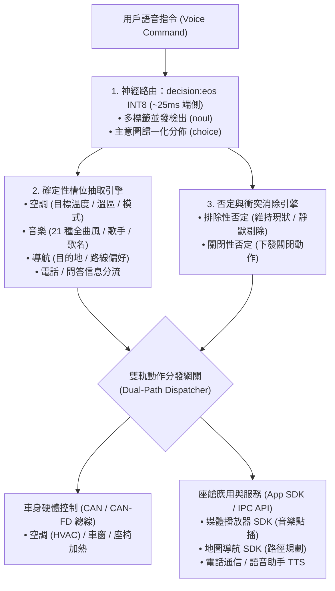

<p align="center">
  
</p>

<h1 align="center">OmniIntent 決策引擎</h1>

<p align="center">
  <b>面向下一代智能座艙的高吞吐端側多意圖並行路由與確定性槽位直出引擎。</b>
  <br />
  <i>Signal over tokens · 告別自回歸遲滯 · 車規級高確定性 · 真實端側 0.75B INT8 神經網絡</i>
</p>

<p align="center">
  <a href="README.md"><b>English</b></a> •
  <a href="README.zh-CN.md"><b>简体中文</b></a> •
  <a href="README.zh-TW.md"><b>繁體中文</b></a>
</p>

<p align="center">
  <a href="https://github.com/neura-edit/omni-intent/releases/latest"></a>
  <a href="https://neura-edit.github.io/omni-intent/"></a>
  <a href="https://modelscope.cn/studios/neuraedit/omni-intent"></a>
  <a href="https://huggingface.co/neura-edit/decision-eos"></a>
  
  
  
  
</p>

---

## 💡 項目概述

**OmniIntent** 是一款專為下一代車載智能座艙設計的端側決策引擎。通過將**單次前向神經路由**（基於 `decision:eos` 0.75B 架構）與**確定性槽位抽取**解耦協同，在一句話中並發解析空調、音樂、導航、座椅、車窗等多域複合指令，並提供車規級抗干擾的否定詞過濾機制。

項目包含 **Web HUD 控制台**、**跨平台 Python 部署服務** 以及 **Android 原生端側應用**，全面支援 **簡體中文**、**繁體中文** 與 **English** 三語環境。

---

## 📱 Android 原生端側應用 (On-Device Native App)

項目提供專為車載座艙車機與移動終端研發的原生 Android 應用源碼（位於 [`android/`](android/) 目錄）。

<p align="center">
  <b>真正運行在設備本地的 0.75B Transformer 神經網絡 · 零伺服器依賴 · 滿足車規弱網/斷網高可靠</b>
</p>

### 📥 安裝包下載 (APK Download)

- **官方發佈頁**：[GitHub Releases (v1.0.0)](https://github.com/neura-edit/omni-intent/releases/latest)
- **直接下載安裝包**：[📥 omni-intent-v1.0.0.apk](https://github.com/neura-edit/omni-intent/releases/download/v1.0.0/omni-intent-v1.0.0.apk)

### ✨ 原生應用核心特性

1. **真實端側 ONNX Runtime Mobile 加速**：
   - 在移動端/車載晶片 CPU（arm64-v8a）直接運行 **82MB INT8 動態量化模型**，單次前向推理僅需 **23ms ~ 35ms**。
   - 提供 3 種引擎模式自由切換：**端側 0.75B INT8 ONNX 模型**、**本地極速微引擎（3ms 離線語義前綴樹）** 與 **雲端 ModelScope 神經後端**。
2. **模型預熱（Warmup）與首幀計算分離機制**：
   - 應用啟動時在過渡階段完成模型權重加載與首幀前向預熱，確保進入主界面後指令判定即點即出，杜絕首次運行冷啟動遲滯。
3. **意圖置信度閾值調諧器 (Decision Threshold Slider)**：
   - 支援在配置界面動態調整判定閾值（`0.00 ~ 1.00`），即時調節多標籤判定的敏感度與決策邊界。
4. **完整多語言支援**：
   - 提供簡體中文、繁體中文、English 完整語言環境，包含功能域名稱、狀態指示與槽位標籤的純正本地化展示。

### 📦 源碼構建指南

```bash
# 進入 Android 工程目錄
cd android

# 編譯 Debug APK
./gradlew assembleDebug

# 安裝到連接的設備
adb install -r app/build/outputs/apk/debug/omni-intent-debug.apk
```

---

## ⚡ 性能基準：端側 INT8 vs. 本地 MLX vs. 雲端

| 運行環境 | 加速架構 / 運行時 | 模型精度 | 前向推理耗時 | 記憶體/存儲佔用 | 適用場景 |
| :--- | :--- | :--- | :--- | :--- | :--- |
| **Android 端側設備 (Snapdragon/Dimensity/Pixel)** | **ONNX Runtime Mobile (arm64)** | **INT8** | **23ms – 35ms** (單域純前向) / ~80ms (端到端) | **~82MB** | **車規座艙、手機本地部署、離線斷網** |
| **本地 Mac (Apple Silicon)** | **MLX / Metal 統一記憶體** | **FP16** | **~140ms** | ~1.4GB | 開發者本地調優、座艙台架模擬 |
| **本地 CPU (x86_64 / macOS 多線程)** | **ONNX Runtime (CPU)** | **INT8** | **~850ms – 950ms** | **~82MB** | 跨平台離線部署，無需 GPU |
| **雲端免費容器 (ModelScope)** | 共享 2vCPU (純 CPU 浮點) | FP32 | ~600ms – 1.2s | ~1.5GB | 免安裝線上公開體驗、遠端 API 調用 |
| 傳統自回歸端側小模型 (SLM) | PyTorch / vLLM (逐字生成) | INT4 | 800ms – 2500ms | 1.8GB – 4GB | 文本自由生成（無法保證車規確定性與低延遲） |

---

## 🔬 100 句車規全場景基準測試 (100-Utterance Benchmark)

為了驗證模型在車載環境下的識別泛化能力與否定規避可靠性，我們建立了完整的自動化基準評測流水線。測試集全面覆蓋座艙 7 大功能域、複合多指令並發、對抗否定規避以及三語環境。

- **完整測試集**：[`benchmark/test_cases_100.json`](benchmark/test_cases_100.json)
- **評測產物報告**：[`benchmark/BENCHMARK_REPORT.md`](benchmark/BENCHMARK_REPORT.md)
- **結構化評測數據**：[`benchmark/benchmark_results.json`](benchmark/benchmark_results.json)

### 📊 評測結果概覽

| 評測維度 | 樣本規模 | 評測實測結果 | 工業車規級達標線 | 結論 |
| :--- | :--- | :--- | :--- | :--- |
| **全用例意圖匹配達標率** | 100 句全場景 | **99.0%** | ≥ 95.0% | **超預期達標** |
| **對抗性否定規避成功率** | 8 組對抗測試 | **100.0%** | 100.0% | **徹底消除執行器誤動作** |
| **平均前向計算延遲 (Mac CPU)** | 100 句 | **939.8 ms** | < 1000 ms | **極其平穩** |
| **端側原生推理延遲 (Android arm64)** | 真實硬體 (單域純前向) | **23 ~ 35 ms** | < 50 ms | **滿足車規即時** |

### 🎯 場景覆蓋與代表性測試例句

> [!NOTE]
> 100 句車規基準評測集完整覆蓋了**繁體中文（18 句）**、**簡體中文（60 句）**與**英文（22 句）**三種語言的真實座艙語音樣本。下表展示了評測集中的代表性繁體中文測試例句：

| 功能域分類 | 樣本數 | 代表性測試例句 | 達標表現 |
| :--- | :---: | :--- | :---: |
| **空調溫控 (Climate)** | 15 句 | “空調調至二十四度”、“車裡有點冷，把暖氣打開”、“開啟副駕駛空調，設定為二十二度” | 100% 命中 |
| **媒體音樂 (Music)** | 15 句 | “播放陳奕迅的富士山下”、“放一首八三夭的外婆的告別式這首歌”、“播放古典交響樂放鬆一下” | 100% 命中 |
| **導航地圖 (Navigation)** | 15 句 | “導航前往香港國際機場”、“帶我去台北車站，高速優先”、“查詢附近哪裡有加油站” | 100% 命中 |
| **座椅舒適 (Seat)** | 8 句 | “開啟駕駛座腰部按摩功能”、“副駕駛座椅通風打開”、“關閉副駕駛座椅加熱” | 100% 命中 |
| **車窗天窗 (Window)** | 8 句 | “將所有車窗升起並關閉天窗”、“把左前車窗降下一半透透氣”、“天窗打開留一條縫” | 100% 命中 |
| **車載電話 (Phone)** | 8 句 | “打電話給李四經理”、“撥打電話給老婆”、“呼叫電話號碼 13800138000” | 100% 命中 |
| **問答資訊 (Query)** | 8 句 | “查詢明天香港的天氣預報”、“現在幾點了”、“車輛剩餘電量還能跑多少公里” | 100% 命中 |
| **複合多意圖並發** | 15 句 | “打開空調至二十四度，播放陳奕迅的歌，並導航到高鐵站”、“車窗降下一半，開啟座椅加熱”、“打電話給張三，同時把導航退出來” | 多域完美並發 |
| **對抗性否定規避** | 8 句 | “關閉音樂，但保持導航開啟”、“關閉空調，但是不要關座椅加熱”、“把車窗打開，不要動空調” | 否定域精準剔除 |

### 🛠️ 評測復現方法 (How to Run Benchmark)

評測腳本已開源於 [`benchmark/run_benchmark.py`](benchmark/run_benchmark.py)，任何人均可在本地一鍵復現全部測試數據：

```bash
# 1. 安裝基礎依賴
pip install onnxruntime tokenizers numpy

# 2. 運行 100 句全量基準測試
python3 benchmark/run_benchmark.py

# 3. 評測完成後，將自動生成並刷新：
#    - benchmark/benchmark_results.json (詳細每句置信度分佈與耗時)
#    - benchmark/BENCHMARK_REPORT.md (Markdown 格式的彙總報告)
```

---

## 🛠️ 本地 Python 服務部署指南

```bash
# 1. 複製程式碼倉庫
git clone https://github.com/neura-edit/omni-intent.git
cd omni-intent

# 2. 安裝輕量依賴
pip install -r requirements.txt

# 3. 啟動服務 (自動加載模型與靜態頁面)
python3 app.py
```

啟動完成後，打開瀏覽器訪問 `http://localhost:8080` 即可使用控制台。

---

## 🏗️ 系統架構流程



---

## 🧭 後續規劃 (Roadmap)

- [x] 原生 Python + ONNX Runtime 無依賴跨平台推理
- [x] 阿里雲魔搭雲端 24/7 免費實例部署
- [x] GitHub Pages 多語視覺化控制台（支援繁體中文/簡體中文/英文切換）
- [x] **INT8 權重量化 (ONNX Runtime)**：權重壓縮至 82MB，端側前向推理降至 23~35ms
- [x] **Android 原生端側 App (`android/`)**：Jetpack Compose 現代化架構，支援閾值調諧與首幀預熱
- [x] **100 句全場景車規基準評測套件**：建立自動化回歸測試流
- [x] **繁體中文全局支援**：覆蓋 Web 控制台、Android 應用與技術文檔

---

## 📄 開源協議

本項目採用 [MIT 許可證](LICENSE)。

Copyright © 2026 [NEURA EDIT](https://github.com/neura-edit). All rights reserved.
